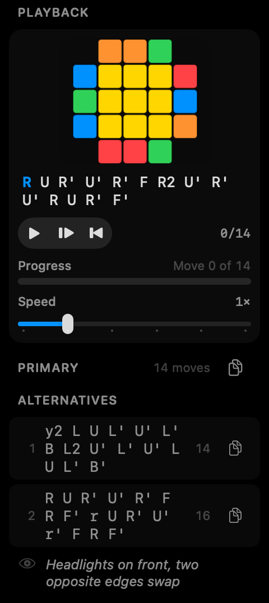
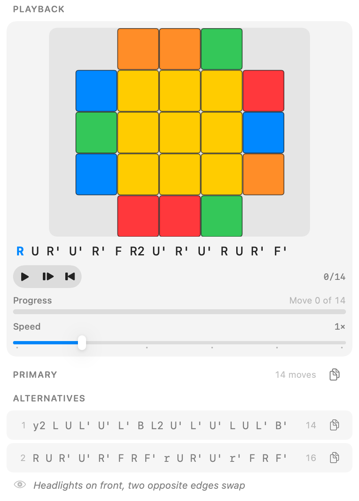

# CubeNotch

Native macOS overlay for 3x3 speedcubing. A borderless, non-activating HUD stays above a timer or browser so algorithm sheets, case diagrams, and setup playback stay glanceable without stealing focus. A separate Library window covers the same cases in a standard Mac document layout.





Invalid-input chrome (no cube diagram): [docs/images/playback-error-compact-light.png](docs/images/playback-error-compact-light.png)

Captures are checked-in SwiftUI renders of playback/detail chrome, not live `NSPanel` screenshots.

## Requirements

- macOS 14 or later (`Package.swift`)
- Xcode 26 with its macOS SDK (the Makefile sets `SDKROOT` from the selected toolchain)
- Python 3 for the audit regression tests

## Build, run, test

```sh
make build   # swift build, warnings as errors
make test    # 123 Swift tests + 17 Python source-audit tests; warnings as errors
make run     # local executable
```

`make` pairs `SDKROOT` with the active Xcode SDK. It does not change the machine’s Xcode selection.

Direct Swift, if needed:

```sh
SDKROOT="$(xcrun --sdk macosx --show-sdk-path)" swift test
```

## Features

- Floating HUD: non-activating panel, corner anchors, compact / medium / large
- Library window plus HUD case browser (search, pins, recents, favorites, copy)
- 57 OLL + 21 PLL (`AlgorithmDatabase.swift`) and 41 F2L (`F2LDatabase.swift`)
- Beginner layer-by-layer steps
- Engine-derived 2D diagrams and discrete inverse/forward algorithm playback
- Built-in timer (inspection, penalties, averages, sessions, export), trainer, and stats
- Global hotkey toggle; spacebar timer (Accessibility permission)

## Limitations

- Playback is discrete (one cube state per move). It is not intra-move animation or a 3D F2L slot view.
- Parser, diagram, and playback tests do not prove that a named case matches a canonical identity. Public-source checks are notation candidates; F2L numbering in particular is unverified against SpeedCubeDB ids. See [docs/ALGORITHM-VERIFICATION.md](docs/ALGORITHM-VERIFICATION.md).
- Interactive foreground hotkey/material smoke checks are not complete.

This repository does not grant a license and does not claim notarized or signed distribution.

## Data

OLL/PLL primaries in-repo are noted as CubeSkills sheets by Feliks Zemdegs and Andy Klise:

- https://www.cubeskills.com/uploads/pdf/tutorials/oll-algorithms.pdf
- https://www.cubeskills.com/uploads/pdf/tutorials/pll-algorithms.pdf

Bounded notation comparison (not identity proofs) used JPerm and SpeedCubeDB:

- https://jperm.net/lib/oll.js
- https://jperm.net/lib/pll.js
- https://speedcubedb.com/a/3x3/OLL
- https://speedcubedb.com/a/3x3/PLL
- https://speedcubedb.com/a/3x3/F2L

JPerm F2L and a CubeSkills F2L dump were not in that verified set. Case tallies and unresolved F2L numbering: [docs/ALGORITHM-VERIFICATION.md](docs/ALGORITHM-VERIFICATION.md).
