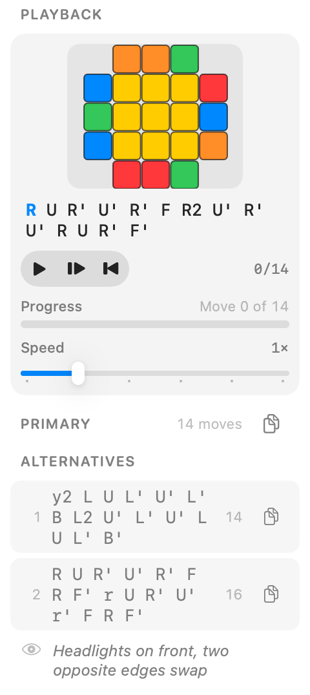

# CubeNotch

A small macOS app for looking up cube algorithms and timing solves. Keep the floating window beside your browser or open the Library for more room.

<picture>
  <source media="(prefers-color-scheme: dark)" srcset="docs/images/playback-compact-dark.png">
  
</picture>

*SwiftUI render of the compact algorithm view. [More views and rendering notes](docs/VISUAL-VERIFICATION.md).*

## What it does

- Browse 57 OLL, 21 PLL, and 41 F2L cases, plus beginner solving steps.
- Search algorithms, pin cases, revisit recent cases, and copy notation.
- Step through an algorithm on a cube diagram, or play it at an adjustable speed.
- Time solves with inspection, penalties, averages, named sessions, and exports.
- Practice recognition with the trainer and review your results in Stats.

The overlay stays above other windows without taking keyboard focus during normal use. Its size and position are adjustable. Recording a new shortcut in Settings temporarily takes focus.

## Build and run

You need Xcode 26 and Python 3. The app targets macOS 14 or later. `make app` creates a local app bundle with the custom icon and an ad-hoc signature. There is no Developer ID-signed or notarized release yet.

```sh
git clone https://github.com/qwertyuiop97/CubeApp.git
cd CubeApp
make run
```

`make run` builds and opens `build/CubeNotch.app`. You can also open that bundle in Finder. The app uses an accessory window, so it intentionally has no Dock icon; Finder uses the bundled cube artwork, while the menu bar uses a monochrome cube symbol.

Hide the overlay with its close button, a double-click, the menu bar item, or the keyboard shortcut. Escape hides it whenever it holds the keyboard. Reduce Motion makes hiding instant instead of animated. Use the menu bar item to show it again. The default shortcut is **Control–Shift–Space**; change it in Settings. The global spacebar timer needs macOS Accessibility permission.

The Makefile selects the macOS SDK from your active Xcode installation. If the compiler or SDK cannot be found, check `xcode-select -p` and select your installed Xcode through its settings.

## Development

```sh
make test
```

This runs the Swift tests and the Python tests for the source-comparison script. Swift warnings fail the build. GitHub Actions also scans Git history for secrets with Gitleaks.

See [CONTRIBUTING.md](CONTRIBUTING.md) for the project layout and development checks, or [NEXT.md](NEXT.md) for current work.

## Current limits

Playback advances one move at a time; it does not animate the turn between states. F2L diagrams are flat views rather than 3D slot illustrations.

The source comparison checks move sequences, not the identity of every pictured case. Different F2L numbering schemes still need mapping. See [the comparison report](docs/ALGORITHM-VERIFICATION.md) before changing algorithm data. [PROBLEMS.md](PROBLEMS.md) lists the remaining testing and distribution gaps.

## Algorithm references

The OLL and PLL database cites the [CubeSkills OLL sheet](https://www.cubeskills.com/uploads/pdf/tutorials/oll-algorithms.pdf) and [PLL sheet](https://www.cubeskills.com/uploads/pdf/tutorials/pll-algorithms.pdf), by Feliks Zemdegs and Andy Klise. The source comparison also uses [J Perm](https://jperm.net/) and [SpeedCubeDB](https://speedcubedb.com/).

These references are credited for their content; they are not affiliated with this project. No software license has been added to this repository.
